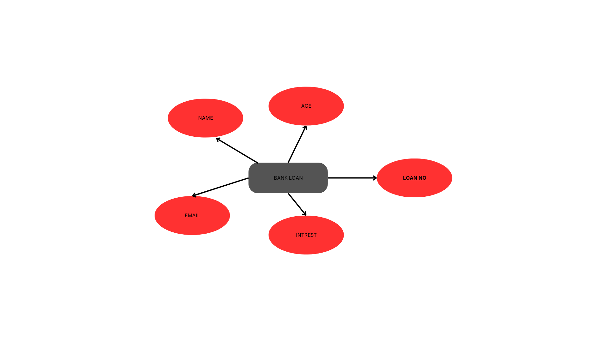

# Ex02 Django ORM Web Application
## Date: 04.11.24

## AIM
To develop a Django application to store and retrieve data from a bank loan database using Object Relational Mapping(ORM).

## ENTITY RELATIONSHIP DIAGRAM

## DESIGN STEPS

### STEP 1:
Clone the problem from GitHub

### STEP 2:
Create a new app in Django project

### STEP 3:
Enter the code for admin.py and models.py

### STEP 4:
Execute Django admin and create details for 10 books

## PROGRAM
'''
admin.py

from django.contrib import admin
from .models import Bankloan,BankloanAdmin
admin.site.register(Bankloan,BankloanAdmin)

models.py

from django.db import models
from django.contrib import admin
class Bankloan(models.Model):
     loan_no=models.CharField(max_length=15,primary_key=True)
     name=models.CharField(max_length=100)
     age=models.IntegerField()
     interest=models.IntegerField()
     email=models.EmailField()

class BankloanAdmin(admin.ModelAdmin):
 list_display=("loan_no","name","age","interest","email")

'''

## OUTPUT

Include the screenshot of your admin page.

## RESULT
Thus the program for creating a database using ORM hass been executed successfully
